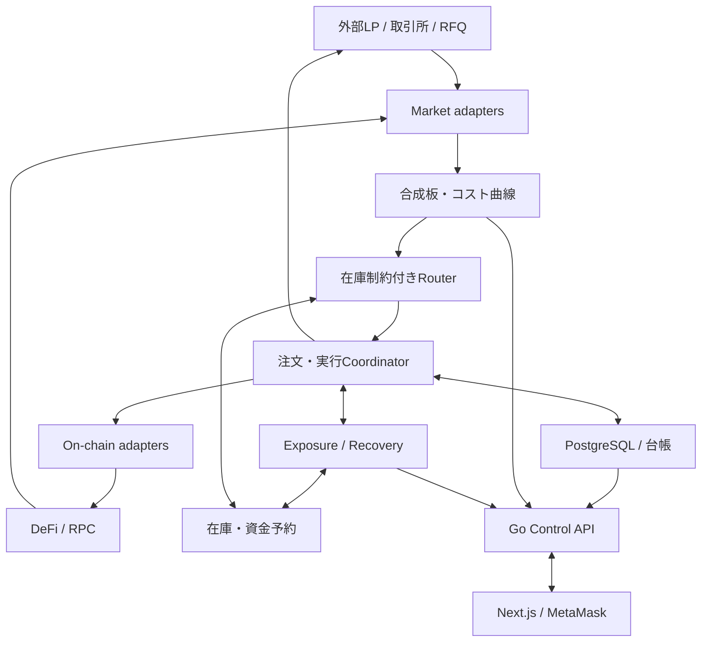
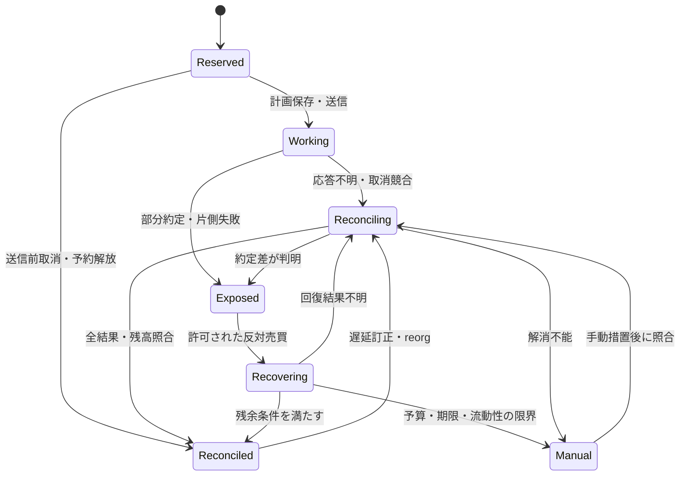
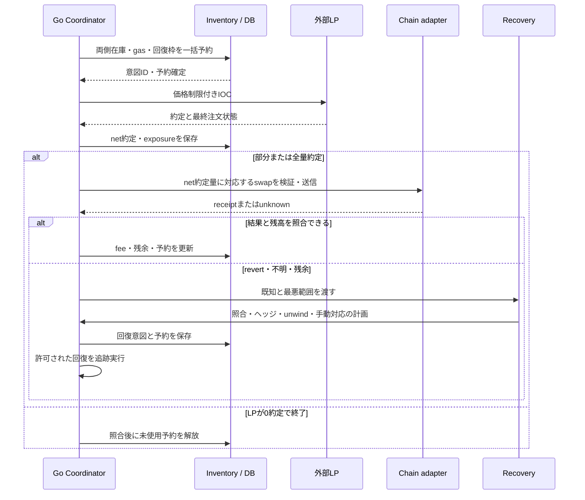

# ARBEX 概要設計

- 状態：Draft / 議論用 v0.2
- 更新日：2026-09-06
- ブランチ：`feature/overview-design`
- 議論：[PR #33](https://github.com/jin-take/arbex/pull/33)
- 関連：[ロードマップ #1](https://github.com/jin-take/arbex/issues/1)、[概要設計 #2](https://github.com/jin-take/arbex/issues/2)
- 本文は設計案であり、実装・接続先契約・性能・収益の検証完了を示さない。

## 1. 改訂の要点

複数の外部LP・取引所・DeFiの流動性を統合し、**合成板と数量別コスト計算を中心に、在庫制約付きの発注ルーターを構築する。**

v0.1の同一チェーンDEX裁定は一つの実行方式として残す。外部LPを含む経路には、接続先別の在庫、注文・部分約定、未約定側の回復処理を追加する。外部LP/CEX連携を初期範囲外としていた記述は本版で置き換える。

| 項目 | v0.1 | v0.2 |
| --- | --- | --- |
| 中心モデル | DEXの往復route | 合成板・数量別コスト・発注計画 |
| 接続先 | 同一チェーンのDEX | 外部LP・取引所・RFQ・DeFi |
| 資金 | Executor中心 | 接続先・口座・chain・asset別の事前配置 |
| 実行 | 一つのTxによる往復 | atomic / non-atomicを区別 |
| 未約定 | Tx全体のrevert | 部分約定、取消競合、未知状態、ヘッジ・巻き戻し売買 |
| 損益 | 往復利益とgas | 約定cash flow、残存リスク、ヘッジ費用、在庫再配置費用 |

このPRは概要設計のみを変更する。設計の議論は同じブランチに集約し、アプリ実装・mainマージは進めない。

## 2. 目的・範囲・決定状態

Owner自身の資金について、複数市場の「見える価格差」と「実際に取れる価格差」を区別し、全費用と片側約定リスクを含めて取引・検証・改善できるようにする。

| 項目 | 状態 | 方針 |
| --- | --- | --- |
| 名前・Engine | 合意済み | ARBEX、Go |
| UI・オンチェーン | 合意済み | Next.js / TypeScript、Solidity / Foundry |
| 流動性集約 | 本版で反映する要件 | 外部LPとDeFiを合成板へ統合 |
| 必要な制御 | 本版で反映する要件 | 接続先別在庫、部分約定、未約定側処理 |
| Owner操作 | 継続 | MetaMask。外部LPのAPI認証は別途必要 |
| 初期市場・口座 | 未決定 | 接続可能な外部LPとBaseのDEXを候補にする |
| 初期執行 | 提案 | 現物・事前資金配置・taker、2レッグから開始 |
| インフラ | 提案 | PostgreSQL、Docker Compose、本番候補AWS |
| liveリスク枠 | 未決定 | 元本、片側数量/時間、日次損失、回復費用をOwnerが設定 |

外部LPとは板配信型・RFQ型を含む取引接続先を指す。DeFi内の流動性供給者個人を一人ずつ独立した板として加算する意味ではない。

初期範囲にはLP↔LP、LP↔DEX、同一チェーンDEX↔DEXの共通モデルを含める。全接続先を同時にlive化せず、capability・契約・利用資格・在庫・ヘッジ経路を確認した組み合わせから段階的に有効化する。特定LPの選定・契約をこのPRで確定しない。

クロスチェーンの橋渡しを取引成立の前提にする経路、レバレッジ・空売り・perpetual hedge、maker待機注文、第三者資金、フラッシュローン、AIによる発注は初期対象外。口座間送金は後述の再配置として取引と分離する。

## 3. 識別子と接続先capability

| 識別子 | 意味 |
| --- | --- |
| venue_id / account_id | 接続先と専用運用口座・subaccount |
| asset_id | chain・contract・custody上の権利を含む実資産 |
| instrument_id | 売買ペア、base/quote、tick/lot、fee asset |
| risk_factor_id | 経済的な価格リスクの集約単位。実資産IDとは別 |
| liquidity_source_id | 実際に消費するpool・板・RFQ注文の識別子 |
| execution_group_id | 裁定の親計画。子注文・回復注文を関連付ける |
| client_order_id / venue_order_id / fill_id | 顧客注文ID、接続先注文ID、約定ID |
| reservation_id / config_revision | 資金予約と設定version |

ETHとWETH、USDとUSDC、別chainの同名tokenを無条件に同一資産として扱わない。経済的リスクを集約する場合も、変換可否・basis・手数料・在庫の所在地は残す。1:1の変換や即時送金は仮定しない。

各adapterは、板配信・sequence/再同期、注文送信、client ID検索、約定履歴、残高、cancel、IOC/FOK、最小数量/金額、price tick、fee asset、quote期限、settlement/利用可能残高、rate limitのcapabilityを宣言する。

未対応機能をエミュレーションで同等と見なさない。例えばIOCがない場合、GTC送信後の即取消はIOCと同じ保証を持たない。注文・約定・残高を十分に照合できない接続先は観測限定とする。

## 4. 全体構成



Go Engine内のmoduleとして市場状態・合成板・Router・Inventory・OMS・Recoveryを分ける。初期は一つのCoordinatorが親計画を直列に状態更新し、接続先別I/Oは並行化する。各口座の資金予約と各EVM signerのnonceは単一writerで管理する。

Control APIとUIは別プロセス。更新・停止要求は認証した内部制御口を通す。UIを閉じても市場購読・注文照合・回復処理は継続する。

| 領域 | 技術・責務 |
| --- | --- |
| Engine | Go、メモリ内差分状態、bounded queue、接続先別worker |
| EVM | go-ethereum。quote、calldata、signer、nonce、receipt |
| 外部LP | GoのHTTP/WS等adapter。接続先が提供する認証・注文仕様に従う |
| API | Go net/http、OpenAPI、監視配信はWS/SSEから選定 |
| Web | Next.js、TypeScript、wagmi/viem、表・チャート |
| Contract | Solidity、OpenZeppelin、Foundry。atomicとsingle-legを分離 |
| 保存 | PostgreSQL/pgx。migration所有者を一本化 |
| 検証・監視 | Go test/race、replay、Foundry fork/fuzz、metrics/log |

## 5. 合成板と数量別コスト

### 元データの正規化

| 入力 | 正規化する情報 | 注意点 |
| --- | --- | --- |
| 板配信LP | Bid/Ask、区間数量、更新sequence | snapshot+deltaを接続先仕様で復元 |
| RFQ | 数量、総受払額、quote ID、期限、許可taker | indicative/firm、分割可否、使用済み状態を保持 |
| AMM | pool状態からの数量別受払額 | fee・tick・丸め・price impactを反映 |

内部の基準は板の見た目ではなく、`BuyCost(q)` と `SellProceeds(q)`。AMMの累積見積もりをUIの段にする場合は、例えば区間単価を `(C(q2)-C(q1))/(q2-q1)` として求める。累積q1と累積q2を独立した流動性として加算しない。

RFQは指定数量でのみ有効なことがある。数量変更・分割・再利用の可否をcapabilityで判断し、任意数量へ補間しない。firm quoteも期限、maker資金、settlement、拒否条件まで無条件に保証されたとは扱わない。

### 二つの表示

- 観測合成板：市場が提示している流動性。取引不可・在庫不足の理由も表示する。
- 実行候補合成板：当該口座残高、fee、lot、期限、capability、リスク枠を適用した計画候補。

実行候補合成板も約定保証ではない。固定gas・最低手数料は単価に一律配賦すると誤順位になるため、最終的な接続先配分ごとに総費用を再計算する。

複数aggregatorが同じpoolへrouteする場合は`liquidity_source_id`で共有制約をかける。同一poolを複数レッグで使う場合は消費後状態を引き継ぐ。元流動性が不明なquoteは同時加算を避け、排他的候補として扱う。

### 時刻・整合性

LP間やLPとchain間に共通の「原子的な現在」はない。各quoteにvenue sequence/block hash、source時刻、受信monotonic時刻、state revision、有効期限を付ける。取得元の時計差を記録し、受信鮮度とsource鮮度を分ける。

接続先ごとの復元が連続していること、鮮度上限と市場間skew許容を満たすことを比較の条件にする。WS欠落やreorgで当該流動性を除外する。古いquoteを持ち続けて板を埋めない。

## 6. 接続先別の在庫と資金予約

### 事前配置

LPでUSDCを使って買い、DEXでWETHを売る場合、LP口座には購入用USDC、DEX側には売却用WETH、Bot側にはgasを事前に置く。購入したLP内のETHを即時にDEXへ送れるとは仮定しない。

全体の価格リスクが相殺されても、LPにETHが増え、DEX側のWETHが減る。在庫の偏りは取引を重ねるほど進むため、価格リスクと接続先別在庫偏差を別管理する。

### 残高モデル

残高のキーは`venue/account/asset`。以下を保持する。

| 項目 | 内容 |
| --- | --- |
| settled_total | 接続先仕様に基づく照合済み残高 |
| venue_hold | 接続先が注文等に拘束している金額 |
| pending_credit / pending_debit | 未利用の入金・出金、未決済の受払 |
| local_reservation | 未送信、送信不明、発注・回復の資金予約 |
| matched_hold | venue_holdと同じ注文に対応する予約 |
| safety_buffer | fee・gas・最低運用残高 |
| allocatable | 新規計画へ割当可能な数量 |

adapterが接続先固有のtotal/free/holdを上記へ正規化する。provider free残高が既に控除したholdを、local予約として再び差し引かない。一方、未反映の注文拘束を無視しない。

```text
allocatable
 = verified_free
 - local_reservations_not_already_in_venue_hold
 - pending_debits_not_already_deducted
 - safety_buffer
```

未決済creditは利用可能と確認できるまで加算しない。残高の時点・注文streamのwatermark・予約対応を照合できなければ、新規配分を停止する。同時刻の整合snapshotが取れない接続先では保守的な控除と明示的照合を行う。

### 予約のライフサイクル

1. Routerが両側の原資・最大手数料・gas・回復用枠を見積もる。
2. DB transaction内で対象口座資産のversion/上限を検査し、一括予約する。
3. execution group、子注文ID、予約・nonceを永続化してから送信する。
4. 部分約定は約定した数量だけ消費し、未約定・応答不明分の予約を維持する。
5. 取消/失効/拒否が確定し、約定履歴と残高を照合できてから未使用枠を解放する。
6. 再起動時は予約、open/closed orders、fills、nonce、receiptを照合し、整合後に状態を復元する。

TTLだけで送信済み/応答不明の予約を解放しない。注文リストから消えたことや404だけで未約定と断定しない。専用subaccount等で他操作を分離することを推奨し、手動取引・入出金を検出した場合は再照合する。

### 在庫偏差と再配置

接続先別にtarget/min/maxを持ち、売買により偏差が減るrouteを費用が同等なら優先する。下限で新規売却を停止し、上限で追加購入を止める。

再配置は裁定注文から独立したワークフローとする。提案→Owner実行→出金pending→入金確認→残高照合を追跡し、最初はBotに外部LPの出金権限を与えない。送金中資金は利用可能に含めず、送金失敗・chain遅延・最低出金・手数料を管理する。期待再配置費用は見積もり、実費は台帳で別々に扱う。

## 7. 在庫制約付き発注ルーター

Smart Order Router（SOR）は合成板の表示順だけで決めず、取引計画単位で次を評価する。

| 制約・費用 | 評価内容 |
| --- | --- |
| 価格 | 数量別総受払、fee asset、価格影響、換算/basis |
| 在庫 | 接続先別原資、予約、gas、回復用資金 |
| 執行 | tick/lot/minNotional、IOC/FOK、RFQ期限・分割、settlement |
| 競争 | データ鮮度、到達遅延、注文拒否/部分約定の観測 |
| リスク | 許容片側数量・時間・損失・未知注文の最悪範囲 |
| 流動性 | shared pool、重複source、自分の既存注文、自己約定防止 |
| 複雑さ | 分割先数、計算期限、同時注文数、rate limit |

親計画にmode、atomicity、asset mapping、レッグ順序、子注文数量・価格上限、予約ID、source revision、fee見積もり、期限、回復policyを固定する。初期は2レッグ・少数分割で計算予算を制限する。

ルーターは通常の利益条件と回復条件を区別する。通常取引は期待利益とリスク制約で選ぶ。既発生リスクを減らす回復注文は、当初の利益を維持できない場合もあり、専用の価格・損失・数量上限内で扱う。どちらも無制限の成行発注にはしない。

未知の約定率を推定実績として埋めない。採算と回復可能性を評価できないrouteは観測限定にする。

## 8. 実行方式：atomicとnon-atomic

| 組み合わせ | 原子性 | 処理 |
| --- | --- | --- |
| 同一chain DEX↔DEX | 単一Txにまとめられる範囲でatomic | 往復Executor、最低残高増分 |
| LP↔LP | 原則non-atomic | 両口座の事前在庫、子注文と約定差分の管理 |
| LP↔DEX | non-atomic | LP注文とchain Txを別々に追跡・回復 |
| on-chain RFQ↔DEX | settlement方式次第 | 同一Txの構成・callback条件を検証した場合だけatomic |

外部LPがFOKを提供していても、もう片側の注文やDEX取引まで原子的にはならない。RFQも経済的拘束・決済方法を確認して分類する。

### 初期のnon-atomic執行policy

- 原則は逐次執行。先行レッグの確定した約定数量に合わせ、後続レッグを送る。
- 先行レッグは、結果を照合しやすく、約定後に残るリスクを他方で抑えられる接続先を選ぶ。常にLP先行と固定せず、route別policyとする。
- LP先行の初期例では価格上限付きIOCを使い、部分約定量が確定したらその量のDEX取引を組む。両側とも事前在庫が必要。
- IOC/FOKの有無・semanticsは接続先ごとに確認する。未対応なら観測限定か別policyのレビューが必要。
- 逐次方式は片側リスクの大きさを把握しやすいが、後続発注までの価格変動・遅延は残る。
- 両側同時送信は将来の任意policy。両側partial/unknownの組み合わせを検証し、worst-case exposureの予算内でのみ有効化する。
- 初期non-atomic liveでは、未照合の親計画がある同一口座・risk factorに新たな裁定を積み重ねない。

前提条件、必要在庫、後続の最大数量、許容損失、最大未ヘッジ時間、取消期限、回復先、fallbackを計画作成時に保存する。数値が未設定ならnon-atomic liveを許可しない。

## 9. 注文・約定・照合（OMS）

### 三層の状態

| 層 | 管理対象 |
| --- | --- |
| ExecutionGroup | 複数レッグの意図、在庫予約、累積リスク、回復、終了条件 |
| ChildOrder / ChainTransaction | 注文ID、価格・数量、送信結果、取消、Tx replacement |
| Fill / Settlement | 実約定数量・価格・fee asset、利用可能時点、訂正・reorg |

単一の成功/失敗フラグで管理しない。venue状態、cumFilled、remaining、cancelPending、reconcileStatus、settlementStatusを独立して保持する。注文取消済みでもcumFilled > 0はあり得る。

- 全子注文に永続的client IDを付け、venue IDへ対応付ける。ID対応や冪等性の保証はadapterで確認する。
- private order/fill streamを使い、欠落時はREST等の注文詳細・約定履歴・残高で補完する。
- fill IDで重複除外し、更新版/訂正を追跡する。cumFilled通知と個別fillを二重加算しない。
- 累積約定と個別fillsが一致しない場合は新規配分を停止し、費用不明の部分を未照合にする。
- 手数料がbase assetで差し引かれる場合、注文表示量と実際のnet asset変化を区別する。
- API timeout/5xx/404やWS切断は「未約定」ではなく「不明」。同じ注文を新IDで盲目的に再送しない。
- cancel受付を取消確定と扱わない。取消処理中のfillを取り込み、最終状態と累積約定を照合する。
- EVMはnonce単一writer、tx hash照合、同一nonce replacementとreceipt finalityを追跡する。

署名前/LP送信前に計画・予約・client ID/nonceを耐久保存し、外部副作用の前後の不明窓を再照合可能にする。DB永続化の待ちをレイテンシとして測るが省略しない。

### 再起動

新規裁定は停止して起動する。open ordersだけでなく、送信意図以降のclosed orders/fills・残高・chain receiptを照合する。pending/unknown予約は維持し、既発生リスクを復元する。exactly-onceの保証は主張せず、単一writer、冪等イベント、実状態の照合を組み合わせる。

## 10. 部分約定と未約定側の処理

### リスク量の定義

各assetのnet変化には売買とbase/quote feeを反映する。承認済みrisk mappingがある場合だけ経済リスクをまとめ、USD/USDC等のbasisは残す。以下の単純式は同一risk factorの現物2レッグについての例。

```text
known_exposure = net_buy_fills − net_sell_fills
             （回復注文の実約定も含む）

possible_exposure = [known_exposure + 最小の追加約定影響,
                     known_exposure + 最大の追加約定影響]
```

unknown・open・cancelPending・未確定chain Tx・未確定ヘッジは、0から残数量まで約定し得る範囲として計上する。リスク枠は既知値だけでなく区間の最悪絶対値・評価額・継続時間でも検査する。on-chain reorgで消え得る約定は暫定扱いにし、同時に逆方向の確定約定が残るケースを評価する。

### 基本の処理順

1. 新規裁定と、リスクを増やす未送信子注文を停止する。
2. open注文へ取消を要求し、最終約定を照合する。送信済みchain Txは未取消として追跡する。
3. 確認できたnet exposureとpossible exposureを更新する。
4. 元の反対側で、実際の未ヘッジ数量だけを処理できるか再見積もりする。
5. 不可なら、事前許可した別LP/DEXでのヘッジ、または約定した側を逆売買するunwindを比較する。
6. 数量・価格・回復損失予算・gas・期限内で実行し、各fill後に再計算する。
7. 回復できなければ `MANUAL_INTERVENTION` に移し、予約・残存リスク・追跡・通知を維持する。

ヘッジは価格リスクを減らす反対売買、unwindは既約定を経済的に戻す追加売買であり、元の約定を取り消すrollbackではない。損失になる場合がある。

### 事象別policy

| 事象 | 必須処理 |
| --- | --- |
| 先行レッグが0約定で終了 | 後続を送らず、照合後に予約解放 |
| 先行レッグが部分約定 | 確定net約定量のみを後続へ。残数量を当初予定量で発注しない |
| 後続も部分約定 | net差分を回復対象にし、既存ヘッジ注文の残数量も含めて再計算 |
| 後続が拒否・失効・revert | 代替反対売買またはunwindを予算内で試す |
| 応答不明・取消未確定 | 注文/約定照合を優先し、未確定分を確定未約定として扱わない |
| 取消後に遅延fillが到着 | 台帳とリスクを再計算し、必要なら回復へ再遷移 |
| DEX未確定中にLP側が成立 | chainが成功/失敗する両シナリオを保持。盲目的な追加ヘッジをしない |
| reorgでDEX約定が消失 | 消えたfill・会計を補正し、残ったLP側リスクから回復を再評価 |
| 最小数量未満の端数 | dustを記録。許容数量/金額内なら残余付き終了、超過なら手動対応 |
| 価格gap・障害で予算内回復不可 | 無制限成行へ切替えず、停止・通知・手動対応。損失上限は保証値ではない |

### 回復注文の制限

通常のminProfit条件は回復には適用しない。ただし、回復元group、許可venue、最大数量、価格上限/下限、gas、試行数、回復費用予算を必須とする。取引損失と回復損失は日次総損失へ合算する。

確認済み約定に加え、送信済み回復注文の残数量も予約する。同じリスクを二つのworkerが二重にヘッジしないよう、risk factor/account単位に回復実行を直列化する。数量はlotに合わせて丸め、過剰売却や無担保shortを作らない。

unknown時の初期方針は照合優先。例外的な緊急ヘッジは、あり得る追加約定を含めた最悪exposureを減らすことと事前許可を条件とする。ゼロ約定を仮定して全量をヘッジしない。ヘッジ先がなければ、残存リスクを隠さずエスカレーションする。

### 部分約定の例（説明用）

前提：1単位の同一経済リスクを買って売る計画。価格リスクの比較上のみETH/WETH等の承認済みmappingを使い、feeはこの例ではquote asset払いとする。実在価格・実績を示すものではない。

| 段階 | 買い累計 | 売り累計 | 既知の片側リスク |
| --- | --- | --- | --- |
| LPのIOCが0.4だけ約定して終了 | 0.4 | 0 | +0.4 |
| 反対LPが0.3だけ約定して終了 | 0.4 | 0.3 | +0.1 |
| 回復注文で0.1を売却・照合 | 0.4 | 0.4 | 0 |

DEXの通常の単一swapはLPのIOCのように任意に部分約定する前提にはしない。LP↔DEXなら、先行の0.4に対応する単一swapを実行し、成功・revert・unknown・finalityを区別する。利用するprotocolが部分fillを持つ場合は別capabilityとして定義する。

### 回復の状態



終了条件は全子注文の最終状態・fills・fee・残高・finalityの照合と、未確定注文なし、exposureが許容範囲内であること。期限が来ただけでunknownや予約を消さない。0リスクで閉じたケース、損失付きunwind、許容dust残余を別結果にする。

## 11. LP↔DEXのシーケンス



LPの応答が不明なら後続処理に0や予定数量を代入せず、OMSの照合・回復状態へ移る。後続DEXの成功見込みが高くても、LP約定を取り消せるとは扱わない。

## 12. コントラクト・鍵・権限

| 方式 | 目的・制約 |
| --- | --- |
| AtomicArbitrageExecutor | 同一chainの往復swap。開始token残高の最低増分を強制 |
| SingleLegExecutor | LPとの組み合わせで一方向swap。許可token/router、quantity、期限、最低受取、価格乖離、利用額制限を強制 |

SingleLegExecutorに「同じtokenへ戻って利益が増える」という条件は適用できない。外部LPの約定をchainから信頼なく検証できるとも仮定しない。保護範囲が異なるため、別contract/権限・資金枠を初期提案とする。

SingleLegExecutorではBotがminOutを0にして任意に資金を減らせないよう、Owner設定の数量/期間利用枠と独立した新鮮な価格参照に対する最大乖離を検討・検証する。参照がない資産はlive対象にしない。参照誤り・depeg・価格変動・owner侵害等のリスクは残り、利益や元本は保証しない。

通常single-legと回復single-legの権限・価格乖離・予算を区別し、回復は事前許可範囲内だけで実行する。無制限call/delegatecall・任意recipient・任意出金をBotへ公開しない。callback送信元、approval、再入、偽tokenを検証し、基本は非upgradeableでversion移行する。

| 主体 | 権限 |
| --- | --- |
| MetaMask Owner | contractの資金枠、入出金、allowlist、pause、Bot権限の付与・失効 |
| LP API key | 対象口座のread/trade/cancel。withdrawは付けない |
| Bot chain key | gas支払いと許可されたexecutor操作 |
| Control API | Owner認証・設定変更・停止指示。任意署名/出金を公開しない |

秘密値はSecrets Manager等で用途別管理し、ログ・DB・UIへ出さない。秘密鍵を使用するGoプロセスのメモリ侵害も脅威として残す。MetaMask seedをサーバーへ置かない。LP API keyをMetaMaskで代用しない。

## 13. 停止・回復・再開

| 制御 | 新規裁定 | 取消・照合 | 事前許可された回復 |
| --- | --- | --- | --- |
| ENTRY_PAUSED | 停止 | 継続 | 有効な経路・予算の範囲で継続 |
| RECOVERY_ONLY | 停止 | 継続 | リスク削減目的に限定 |
| HALT_ALL | 停止 | 可能なread/取消は継続 | 新たな売買送信も停止、手動対応 |
| Contract paused | 対象contractは不可 | 追跡 | そのcontractは使えない |

既発生exposureがあるとき、通常裁定の損失枠超過を理由にヘッジまで無条件で止めるとリスクが残る。通常枠と回復枠をあらかじめ分け、停止の意味をUIで明示する。ただし全体緊急停止や権限失効を回復名目で迂回しない。

DB障害時は新規発注を停止する。永続化できない回復売買を自動で継続せず、read/取消可能性を確認し、必要な手動措置を通知する。停止は送信済みLP注文・chain Txの取消保証ではない。

再起動後は新規裁定を自動再開しない。既存リスクの照合・監視は直ちに復元し、回復売買の自動再開は、事前承認済みpolicy・永続状態・権限・予算を確認できる場合だけ許可する。初期はRECOVERY_ONLYの可否を確認してからOwnerが新規裁定を再開する。

## 14. 損益・台帳

```text
計画の予想純利益
 = 売却総受取 − 購入総支払
 − 未計上の売買手数料 − chain実行費
 − 期待再配置費用 − リスク/回復の見積もり調整

実現損益
 = 確定した約定と回復売買のcash flow・原価に基づく損益
 − 実行/ヘッジ/取消等で実際に課金された費用
 − 実際の再配置費用 − 固定費
```

quoteに含むfee/price impactを二重控除しない。会計の原価方式・報告通貨・fee換算時刻を固定し、fillごとのbase/quote/第三assetの動きを台帳へ記録する。損失付きunwindも親計画へ帰属させる。sharedなヘッジ・再配置費用は配賦根拠を保存し、実費と計画上の見積もりを混ぜない。

片側だけ約定した時点で「売却額−予定購入額」を実現裁定利益として計上しない。残余在庫の含み損益・basis・未照合費用・未決済受払を別表示する。既存在庫を売却した原価と、戦略開始時からのNAV変化を照合し、入出金・保有価格変動・運用利益を分ける。

実現損益、暫定約定、shadow成績を分離する。reorg・trade correction・手数料確定遅延は修正記録を追加して再集計する。履歴を上書きして差分の根拠を失わない。

## 15. 保存モデルとAPI

| モデル | 主な保存内容 |
| --- | --- |
| Venue / Instrument / Capability | 口座、asset mapping、lot/fee/期限/注文機能 |
| SourceSnapshot / Quote | 元流動性、sequence/block、受信時刻、価格曲線、RFQ ID |
| SyntheticBookRevision | 候補の根拠revision、構成source、取引不可理由 |
| Balance / Reservation | 資産・口座別残高、hold対応、予約、pending、照合状態 |
| ExecutionGroup / ChildOrder | 計画、atomicity、実行順、client ID、期限、risk budget |
| Fill / Settlement | net数量、価格、fee asset、訂正、確定/利用可能状態 |
| Exposure / RecoveryAction | 既知・最悪範囲、発生時刻、回復意図、未確定ヘッジ |
| Rebalance | 提案、出入金ID、送金中資金、実費、完了照合 |
| Ledger / Audit | cash flow、原価、損益、操作actor、設定revision、停止理由 |

金額・数量は整数、固定小数または有理数で精度を明示し、float64を発注判定へ使わない。APIでは10進文字列、時刻はUTC、処理区間はmonotonic差分で扱う。

OpenAPIの対象はstatus、venues、synthetic-book、inventory、plans、orders、fills、exposures、recoveries、pnl、config、pause/resume。UI配信はsequence/cursorとsnapshot再取得を持つ。任意注文/署名を透過的に公開せず、Ownerの許可された設定・停止・回復判断だけを受け付ける。

MetaMaskログインはnonce/domain/URI/chain/期限付き署名とOwner allowlistで検証する。接続だけでは管理権限を与えない。session、CSRF、設定revision競合、操作監査を実装対象とする。

## 16. UI

| 画面 | 内容 |
| --- | --- |
| Overview | 全費用込み実績、未実現損益、資金偏差、Engine/LP接続状態 |
| Synthetic Book / Radar | Bid/Ask合成板、元LP/DEX内訳、観測/実行候補、数量別総費用、鮮度 |
| Inventory | venue/account/asset別のfree/hold/予約/pending、目標・上下限、再配置提案 |
| Executions / Replay | 親計画→子注文→fills、partial/cancel/unknown、処理区間と見送り理由 |
| Exposure / Recovery | net/possible exposure、経過時間、回復先・予算・結果、手動介入 |
| Control | mode、接続先許可、原資/片側/損失上限、停止範囲、認証・権限状態 |

初期UIは合成板、在庫、exposure、注文詳細を優先する。含みリスクがある状態で「停止済み」だけを表示しない。未知・未確定・未照合は目立つ状態として残す。demoは明示的に選択し、実市場断で自動切替しない。

通常経路と回復経路、価格リスク解消と資金再配置を区別する。合成板の全深さが一度に消費できると誤解させず、source共有・予約・firm期限を表示する。

## 17. レイテンシ・可用性

Goを継続する。Rust移行は同一リプレイの結果でCPU/GCが制約と確認した場合に限定検討する。接続先配信間隔・ネットワーク・LP内部処理・chain組み込みは言語変更では解消しない。

- 接続先別に受信・sequence復元・時刻補正を分離する。
- 合成板/コスト曲線/在庫のread snapshotをメモリに保持し、変化したsource/価格帯/routeだけ更新する。
- LP間で一つの巨大lockを使わず、所有権を定めたpartitionで更新する。回復と予約の単一writerを維持する。
- bounded queue、期限付き計画、rate limit、取消・回復用のAPI処理枠を用意する。
- UIやrawログを送信経路の同期待ちにしない。一方、予約・送信意図・回復意図の耐久記録は省略しない。
- 時計差、ネットワーク往復、CPU、GC、DB待ち、署名、LP受付→fill、chain確定を別計測する。
- p50/p95/p99、更新件数、queue深さ、機会寿命内の到達割合、未ヘッジ時間、unknown継続時間を評価する。

LP数・ペア数・tick深さ・RFQ頻度・平均/バースト更新量を計測条件として保存する。受信負荷とAMM計算負荷を別に上げて限界を測る。必要なp99目標、region、CPU/メモリ、RPC契約は計測後に決め、架空の性能保証を置かない。

初期は単一Coordinator。移行時に旧新プロセスが同じ予約・client ID・nonceを扱わないよう、drain、所有権fencing、署名/送信直前の権限確認と再照合を設計する。

## 18. 検証と受入シナリオ

| ケース | 合格条件 |
| --- | --- |
| 累積AMM quoteを板へ変換 | 区間数量が重複せず、実数量のfork結果と照合 |
| 同じpoolを別aggregatorが参照 | 深さを二重加算しない |
| USD/USDC、ETH/WETH | asset IDを保持し、basis/変換制約を失わない |
| 同じ口座へ複数計画が予約 | 原資・fee・回復枠を超えない。holdを二重控除しない |
| pending入金・手動出金 | 利用可能残高へ誤反映せず、変更時は候補を失効 |
| 1.0予定、0.4買い、0.3売り | 残余0.1だけ回復し、手数料asset/lotの差を反映 |
| cancel受付後に追加fill | 元注文をゼロ扱いせず、予約とヘッジを再計算 |
| LP受付後の応答喪失 | 新ID再送を避け、client ID/約定履歴で照合 |
| 元注文もヘッジもunknown | 両者の可能約定範囲を含め、重複回復を防ぐ |
| DEX revert / pending / reorg | LP側fillを保持し、未知範囲と残余から回復 |
| 回復先も部分約定 | 回復予約を維持し、残数量だけ次に扱う |
| 回復予算超過・流動性消失 | MANUALへ移り、リスク・予約・通知を維持 |
| dust・minNotional | 上限内残余を明記し、無理な過剰hedgeをしない |
| entry停止と全停止 | 回復許可の違いがAPI/UI/Engineで一致 |
| 送信直後のprocess/DB障害 | restartで注文・fill・残高を照合し二重発注しない |
| shadow対live | shadow約定を実績にせず、partial/拒否/遅延仮定を明記 |

replayには板、私有注文stream、fills、残高、タイマー、RPC状態、設定revisionを記録する。正常系と障害注入を同じ入力で再現し、未来情報を判定に混ぜない。保管する認証付きpayloadは秘密値を除去する。

contractはatomicとsingle-legの双方についてfork/fuzz/invariantを行う。利益未達、minOut回避、価格参照stale、callback偽装、回復権限悪用、出金権限を検証する。実接続先を未選定のまま適合テスト完了とはしない。

## 19. 段階的な開発

| 段階 | 成果物 | 移行条件 |
| --- | --- | --- |
| M0 設計・基盤 | asset/venue/注文/資金境界、capability、型・CI・DB | 概要設計合意と再現可能なbuild |
| M1 観測 | 外部LP adapter、DeFi quote、合成板、在庫参照 | 板整合、source重複、残高・費用を検証 |
| M2 Shadow | SOR、部分約定・unknown・回復シナリオ、replay | 誤差・遅延・リスクと採算の根拠 |
| M3 実行準備 | OMS、予約、contract、hedge、会計、UI | 故障注入・資金権限・再起動照合を検証 |
| M4 限定live | 明示したvenue/asset/資金/期限での運用 | 回復先と在庫、各損失枠、停止・通知を設定 |
| M5 改善 | 接続先追加、並行執行、性能、在庫配分 | 実測で効果・追加リスクを評価 |

atomic liveの成功だけではnon-atomic liveを有効にしない。外部LPの認証・利用条件・残高・部分約定・取消・回復経路の適合確認を別に行う。

移行時にOwnerが設定する値：元本/venue偏在上限、1計画数量、最大net/possible exposure、最大未ヘッジ時間、quote/skew期限、価格乖離、通常/回復gas・損失・試行数、dust許容、回復先、通知先、運用期間。未設定ならliveにしない。

価格gapや全接続先障害で、損失が設定予算を超える可能性はある。予算は自動発注・回復を制約するもので、実損失の保証上限ではない。

## 20. リポジトリ構成案

| path | 責務 |
| --- | --- |
| cmd/arbex | engine / api / record / replay |
| internal/domain | asset、instrument、book、order、fill、money |
| internal/venue | capability、外部LPのmarket/trading/account adapter |
| internal/market | LP板、RFQ、chain状態と復元 |
| internal/dex | AMMごとのquote |
| internal/liquidity | 合成板、区間コスト、source共有制約 |
| internal/inventory | 接続先残高、予約、偏差、再配置 |
| internal/router | 数量配分、通常発注計画 |
| internal/oms | 親計画・子注文・約定・取消・照合 |
| internal/execution | chain送信、nonce、signer、simulation |
| internal/recovery | exposure、ヘッジ、unwind、手動対応 |
| internal/risk | 通常/回復予算、停止・再開 |
| internal/storage | 台帳、記録、監査 |
| internal/api | Owner認証、監視と制御 |
| apps/web | Next.js Terminal |
| contracts | atomic / single-leg Executor、Foundry |
| deploy / docs | 開発・運用・設計・ADR |

このPRで実装ディレクトリを生成しない。module境界・DB/API詳細は設計合意後に実装Issueへ落とす。

## 21. 議論する論点

D01〜D08は既存論点のIDを維持し、対象を外部LPまで拡張する。

| ID | 論点 | 現在の提案・未決定 |
| --- | --- | --- |
| D01 | 初期市場 | 外部LPとBase DEX。実LP・pair・口座は未選定 |
| D02 | 資金配置 | 接続先別事前在庫、回復原資、Botは出金不可 |
| D03 | DeFi pool型 | 実流動性に応じvolatile/Slipstreamを選択 |
| D04 | 成功基準 | 全費用・回復損失・未ヘッジ時間・在庫再配置込み |
| D05 | 接続・配置 | LP/RPCごとの配信・注文遅延・region・費用を比較 |
| D06 | UI | 合成板、在庫、注文、exposureを優先 |
| D07 | live上限 | 通常枠と回復枠、未知約定の最悪範囲、最大時間 |
| D08 | Contract更新 | atomic/single-leg分離、非upgradeableを提案 |
| D09 | LP注文機能 | IOC/FOK、client ID照合、private streamの必須条件 |
| D10 | 執行順序 | 初期は逐次、結果と回復可能性から先行側を選ぶ |
| D11 | 未知状態・停止 | 照合優先、RECOVERY_ONLY/HALT_ALL、例外ヘッジ |
| D12 | 在庫再配置 | 目標配分・偏差上限、初期はOwner実行の送金 |

PRの行コメントやこの会話でD番号を指定して議論し、結論は同じブランチと関連Issueに反映する。LP選定・運用金額の未決定を理由に設計案の作成を止めず、liveの設定項目として明示しておく。

## 22. バックログとの対応

既存の#3〜#14はGo/DB/DeFi基盤として利用する。DEX専用の#15〜#17、#19/#25はatomic経路の実装として残し、合成板・SOR・non-atomicの依存と責務を分ける。#21/#22/#28のatomic Executorを、そのままLP↔DEXに転用しない。

新しい設計の中心は、外部LP capabilityと正規化、合成板、接続先別予約、SOR、OMS、SingleLegExecutor、Exposure/Recovery、障害再生、UIである。関連IssueはPRとロードマップ#1から追跡する。設計Issue#2はレビュー完了までcloseしない。

## 23. 参考資料と確認境界

以下はadapter要件を考えるための一次資料。特定接続先の採用決定や、他LPにも同じ保証があるという意味ではない。実装時には採用API/version/権限を再確認する。

- [Coinbase Exchange WebSocket channels](https://docs.cdp.coinbase.com/exchange/websocket-feed/channels)：snapshot/streamと欠落補完を検討するための資料。
- [Coinbase Exchange single order](https://docs.cdp.coinbase.com/api-reference/exchange-api/rest-api/orders/get-single-order)：client ID検索、404や注文状態の変化に注意するための資料。
- [Coinbase International order details](https://docs.cdp.coinbase.com/api-reference/international-exchange-api/rest-api/orders/get-order-details)：IOC/FOK定義の具体例。初期で同サービスやderivativesを採用する意味ではない。
- [0x FAQ](https://docs.0x.org/docs/introduction/faq)：RFQ期限と失敗要因。固定の有効秒数を全LPへ適用しない。
- [Uniswap concentrated liquidity](https://developers.uniswap.org/docs/get-started/concepts/liquidity-providers/concentrated-liquidity)
- [Geth developers](https://geth.ethereum.org/docs/developers)
- [Go GC guide](https://go.dev/doc/gc-guide)
- [Base RPC](https://docs.base.org/base-chain/api-reference/rpc-overview)
- [Base fees](https://docs.base.org/base-chain/network-information/network-fees)
- [Aerodrome docs](https://aerodrome.finance/docs)
- [Foundry fork tests](https://www.getfoundry.sh/guides/fork-testing)
