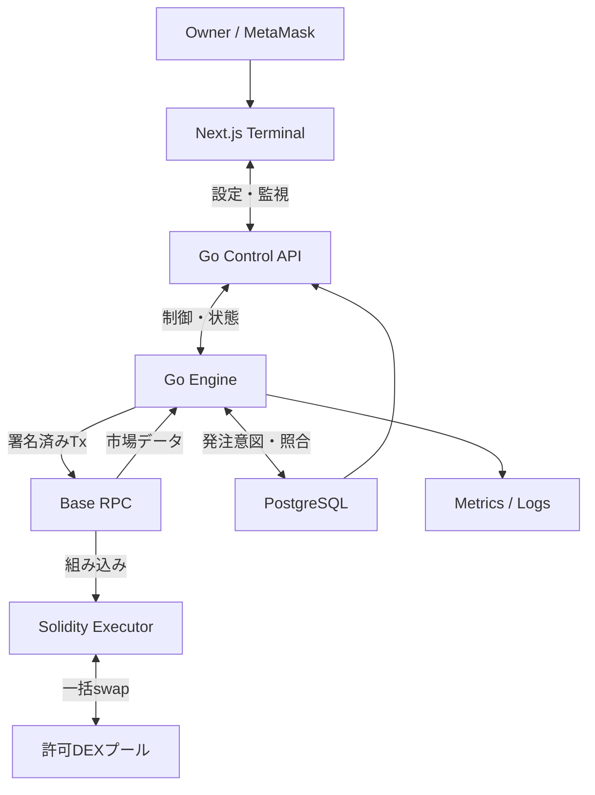
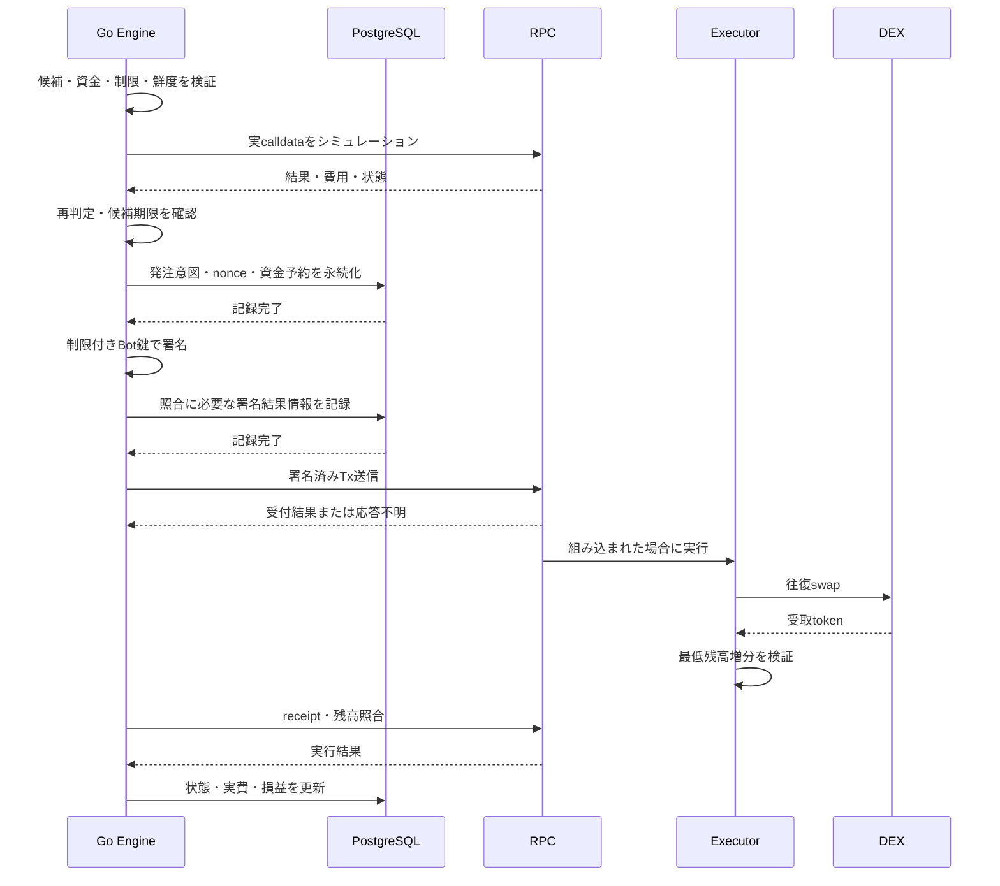
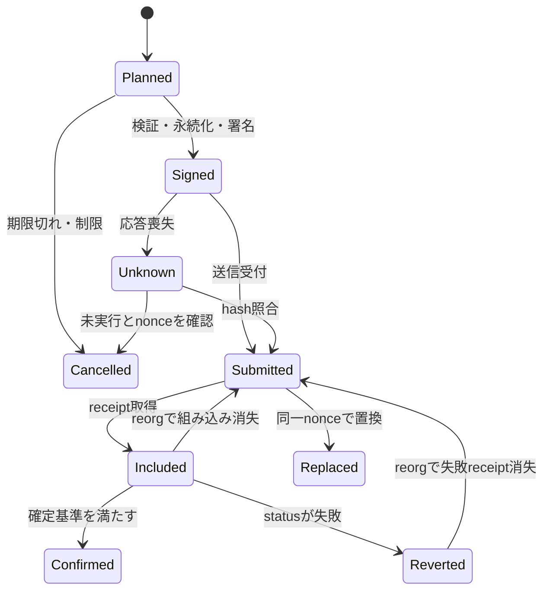

# ARBEX 概要設計

- 状態：Draft / 議論用 v0.1
- 作業ブランチ：`feature/overview-design`
- 関連Issue：[ロードマップ #1](https://github.com/jin-take/arbex/issues/1)、[概要設計 #2](https://github.com/jin-take/arbex/issues/2)
- この文書の目的：実装前に、何を作るか、どこで資金を扱うか、何を測って改善するかを合意する。
- 実装・デプロイ・資金投入の完了を示す文書ではない。数値や市場の採算は未検証。

## 1. プロダクトの目的

ARBEX = Arbitrage × Execution。

同じチェーン上のDEXに生まれる価格差を観測し、投入数量と全実行費用を考慮して経路を評価する。実行可能な経路は限定した資金と権限で自動実行し、その結果を監視UIから検証する。

目標は「表示上の価格差を見つけること」から「自分の実行環境で費用控除後に利益が残るかを説明できること」までを一貫して扱うこと。利益を保証するものではなく、採算が確認できない市場は対象変更・運用見送りも判断結果とする。

### 主な利用者と操作

| 利用者 | 操作 |
| --- | --- |
| Owner | MetaMask接続、監視、設定変更、資金枠・権限の管理、停止・再開 |
| Go Engine | 状態更新、経路・数量探索、判定、シミュレーション、限定権限での実行 |
| 開発者 | 記録データの再生、quote検証、性能計測、障害再現 |

初期版はOwner自身の運用を対象とする。第三者の資金預かり、公開取引サービス、複数顧客の管理は対象外。

## 2. 合意済み・提案・未決定

| 項目 | 状態 | 内容 |
| --- | --- | --- |
| 名前 | 合意済み | ARBEX / arbex |
| 取引エンジン | 合意済み | Go。検知から署名・送信までGo内で完結 |
| UI | 合意済み | Next.js / TypeScript |
| オンチェーン実行 | 合意済み | Solidity / Foundry |
| ウォレット | 合意済み | MetaMaskをOwnerの操作に使う |
| 検証方針 | 提案 | 観測→シャドー→限定資金の実売買 |
| 初期市場 | 提案 | Base、Uniswap V3、Aerodrome、USDC/WETH |
| 初期経路 | 提案 | 同一資産で始まり終わる2レッグ、自己資金方式 |
| 資金配置 | 提案 | 運用枠のみExecutorに配置。Botはガス用ETHを保持 |
| DB・インフラ | 提案 | PostgreSQL、ローカルDocker Compose、本番候補AWS |
| RPC・pool・運用金額 | 未決定 | 実データとOwnerの運用条件に基づき確定 |

「提案」はこのPRで修正できる。Issueの記載と設計を変更した場合は、関連Issueの範囲・依存関係も更新する。

## 3. 初期範囲

### 含めるもの

- chain/token/poolを許可リストで限定した市場購読。
- 同一状態にそろえたプール情報と、数量別の往復見積もり。
- gas、L1データ費、価格影響、失敗費用を区別した利益評価。
- 観測記録、決定論的リプレイ、実遅延を反映したシャドー評価。
- 1トランザクションでの往復swapと終了残高の最低増分条件。
- 送信状態・nonce・未確定資金・receipt・損益の照合。
- MetaMask所有者認証、監視画面、実行制限、緊急停止。

### 初期範囲の外

| 機能 | 扱い |
| --- | --- |
| CEX連携・クロスチェーン裁定 | 別戦略。片脚・在庫・送金リスクの設計が必要 |
| 3レッグ・多銘柄 | 2レッグ評価後に効果と計算負荷を比較 |
| フラッシュローン | 自己資金での実績を確認後、手数料込みで検討 |
| Rust化 | 計算・GCが原因と実測できた場合に限定検証 |
| Smart Accounts / Advanced Permissions | Base・権限・コスト・遅延の適合性を確認して検討 |
| AIによる注文判断 | 初期対象外。将来のログ分析補助と決定論的発注判定を分離 |

初期ペアで候補が出ない場合、捏造した利益を表示せず、観測結果をもとにpoolや市場の変更を議論する。

## 4. システム構成



### プロセスの責務

| 要素 | 責務 | 持たせない責務 |
| --- | --- | --- |
| Next.js | 表示・設定入力・MetaMask操作 | 経路探索、Bot秘密鍵、取引の自動署名 |
| Go Control API | 認証・認可、設定revision、状態・履歴配信 | 任意calldataを受け取る署名API |
| Go Engine | 購読、状態、探索、検証、署名、nonce、送信、照合 | ブラウザやUIの可用性への依存 |
| Executor | 限定したswap・権限・残高増分を強制 | 外部通信、RPC見積もり、gas込み収益の保証 |
| PostgreSQL | 設定、発注意図、tx、損益、監査・記録metadata | 毎候補のpool状態検索 |
| RPC adapter | chainとの通信、再接続、capability差の吸収 | providerごとの前提をEngine全体へ漏らすこと |

初期は単一の実行writerを置く。APIとEngineは同じGo moduleの別プロセスを想定し、Control APIは内部の認証された制御口へ設定・停止要求を渡す。Engineを自動水平増設しない。

### 実装技術の提案

| 領域 | 技術 |
| --- | --- |
| EVM通信・署名・ABI | go-ethereum |
| Go API | 標準net/httpを基本とし、必要時のみrouterを追加 |
| Web | Next.js、React、TypeScript、wagmi、viem |
| UI部品・可視化 | Tailwind CSS、shadcn/ui、TanStack Table、EChartsを候補 |
| コントラクト | Solidity、OpenZeppelin、Foundry、Anvil |
| DB | PostgreSQL、pgx、単一のmigration所有者 |
| テスト・CI | Go test/race、Foundry fork/fuzz、Web型検査、GitHub Actions |
| 監視 | Prometheus互換metrics、構造化log、CloudWatch等 |

Next.jsからDB schemaを別途管理しない。取引数量の型・ABI・API契約を共有するが、UIの依存を実行Engineへ持ち込まない。

## 5. 市場データと見積もり

### データの取得

1. token/pool/router/factoryの実在、ABI、token順序、decimals、fee、pool型を公式情報とRPCで検証する。
2. 共通block/hashを基準に初期snapshotを取得する。
3. WSで必要なpool更新を取得し、block/tx/log順序を整えて適用する。
4. 切断時はcheckpointからHTTPで補完する。重複は除外し、連続性を確認するまで実行候補を停止する。
5. reorg時はrollbackまたは再同期し、影響した候補・receipt・損益を無効化して照合する。

未確定データと確定データを別に管理する。Base固有の配信方式や将来の変更はRPC adapterで吸収し、特定APIが全providerで使えると仮定しない。

### プールごとの計算

| pool型 | 必要な状態 | 注意点 |
| --- | --- | --- |
| Uniswap V3 | sqrtPrice、liquidity、initialized ticks、fee | tick越えと整数丸めを実装 |
| Aerodrome volatile | reserves、現行fee、token順序 | 実際のfee取得と丸めを照合 |
| Aerodrome Slipstream | 採用versionの集中流動性状態 | UniswapとABI/feeが同じと仮定しない |
| 未対応pool | なし | 候補から除外し理由を表示 |

volatile poolを必ず先に採用するわけではない。対象流動性を確認し、Slipstreamが必要ならその対応を初期必須へ変更する。stable poolや特殊tokenを別モデルで誤計算しない。

### 探索

- 変更poolから関連routeを逆引きし、影響した経路のみ再計算する。
- 例：USDC → UniswapでWETH → AerodromeでUSDC。
- 複数の投入量を粗く探索し、有望区間を精査する。利益曲線が常に単峰とは仮定しない。
- 各レッグの受取数量を次へ渡し、手数料と自分の注文の価格影響を含める。
- stale・不完全なtickデータ・資金不足・費用不明・計算期限超過は候補を棄却する。

金額は最小単位の整数で扱い、float64を売買判定に使わない。Goのbig.Intの入力変更・参照共有を防ぎ、中間演算の精度と丸め方向を明示する。JSONでは数量を10進文字列として扱う。

## 6. 利益の定義

```text
予想純利益
  = 往復後受取額 − 投入額
  − L2実行費 − L1データ費 − その他の実行費

戦略の実現純利益
  = 成功取引の裁定利益
  − 成功/失敗取引に実際に課金された全費用
  − RPC・サーバー等の固定費
```

DEX feeとprice impactが受取額に織り込まれている場合、もう一度控除しない。gas資産から開始tokenへの換算基準・時点・鮮度を保存する。不明費用は0扱いしない。

予想、shadow結果、未確定receipt、確定実績を分ける。入出金や保有資産の値上がりを裁定利益に混ぜない。成立確率は実測から評価し、未観測の値を勝率として表示しない。

## 7. 資金・鍵・権限の境界

MetaMaskはOwnerの承認と管理に使う。常時ブラウザで署名を待つ方式ではない。

| 主体 | 保持資産・権限 |
| --- | --- |
| Owner / MetaMask | 運用枠の入出金、Bot権限の付与・失効、allowlistや上限の変更、pause |
| Executor | 限定した運用token。許可された経路のswapのみ実行 |
| Bot実行鍵 | ガス用ETHと限定された実行権限 |
| UI / Control API | 表示と制御要求。秘密鍵・任意送金権限は保持しない |

OwnerからExecutorへの入金は通常のオンチェーン操作で行い、出金はOwnerのみが行う。未確定取引中の入出金があれば候補を失効し、残高を再照合する。

Botは任意recipient、任意call/delegatecall、owner変更、出金を指定できない。allowlistに加え、必要なtoken・数量上限・最低増分の下限をcontract側でも強制する。BotがminProfitを0にして保護を回避できる設計にしない。

owner権限そのものと、allowlistに登録したcontractへの信頼は残る。Bot鍵の権限制限だけで、悪意あるpool・侵害されたowner・全ての市場損失を防げるとは扱わない。

### Executorの基本条件

- 最初はpaused。開始tokenと終了tokenを一致させる。
- recipientはExecutorに固定し、pool/adapter/token/fee・callback送信元を検証する。
- 終了残高 ≥ 開始残高 + 要求最低増分を満たさなければ全体revertする。
- 最低増分はgas控除前。revertでも課金されるgasがあり、off-chainの費用判定と損失予算が別途必要。
- approvalは許可routerに限定し、再入・異常ERC20・不正callbackをテストする。
- 固定version・非upgradeableなExecutorを初期提案とする。改修時は新versionへ明示移行する。

## 8. 実行フロー



市場更新を受けたらsimulation済み候補も再評価する。シミュレーションは直後の組み込み・利益を保証しない。

探索はメモリ内で行う。一方、署名前の発注意図・nonce・資金予約の永続化と、送信後の再照合は省略しない。DB障害時は新規発注を止める。耐障害性のための永続化遅延は独立した指標として測る。

### 取引状態



図は主要状態を示す。replacementは元の発注意図へ関連付け、置換先Txも結果確定まで追跡する。receiptの失敗も確定状態を別に保持する。Confirmedもchainの確定基準に従い、絶対に巻き戻らないと仮定しない。

RPC timeoutを未送信と断定して別nonceで再発注しない。tx hash・nonce・chain状態を照合し、解消できなければ停止する。厳密なexactly-onceを宣言せず、冪等な処理と照合によって二重の経済取引を防ぐ。

## 9. 実行モードと停止

| mode | 入力 | 判定 | 自動署名・送信 |
| --- | --- | --- | --- |
| demo | 明示したfixture | UI/動作確認 | なし |
| observe | 実市場 | 状態・候補の観測 | なし |
| shadow | 実市場または記録 | 遅延付き仮想評価 | なし |
| live | 実市場 | 全条件を通過した候補 | 限定権限・資金で実行 |

モードと「running/paused/degraded/stopped」の稼働状態は別項目にする。restartでliveを自動再開せず、nonce・残高・receipt・権限の照合後に再開する。

| 事象 | 基本動作 |
| --- | --- |
| feed欠落・stale・reorg | 候補無効化、状態復旧まで新規発注停止 |
| DB停止・照合不能 | 新規発注停止、可能な範囲でpending追跡 |
| gas/日次損失/連続revert上限 | 新規送信を停止し理由を通知 |
| Owner停止 | 新規署名・送信を停止、pendingは追跡 |
| contract pause・権限失効 | 実行不可を検出、再開には権限と状態の確認 |

Bot停止はpending Txのキャンセルではない。オンチェーンpauseも組み込み順序・課金に制約がある。運用停止とchain操作の結果を別表示する。

## 10. データとAPI

| データ | 保存内容 |
| --- | --- |
| PoolSnapshot | chain、block hash、状態revision、token、fee、必要な流動性状態 |
| Observation | 受信順序・時刻、raw payload、欠落・reorg、取得元 |
| Opportunity / Quote | route、投入額、受取額、費用、期限、棄却理由、設定revision |
| ExecutionIntent | 意図ID、nonce、資金予約、calldata hash、状態 |
| Transaction / Receipt | tx hash、replacement関連、結果、実費、確定状態 |
| Ledger | 裁定利益、gas費、固定費、入出金、評価損益、照合状態 |
| Audit | 操作者、設定差分、revision、停止・再開・権限操作 |

大量のraw観測は保持期間・partitionを決め、必要に応じてobject storageへ移す。PostgreSQLには検索と復元に必要なmetadataを保持する。tx hash・log identity・意図IDには冪等性の制約を置く。

外部APIはOpenAPIで定義し、例としてstatus、opportunities、executions、pnl、config、pause/resumeを扱う。配信はWebSocketまたはSSEを選定し、sequence/cursorと再接続時snapshotを持つ。

Go Engineのraw署名・任意送信APIを公開しない。API契約で金額文字列、UTC時刻、未知値、mode、source、state revisionを定義する。

## 11. UIの構成

| 画面 | 主な情報・操作 |
| --- | --- |
| Overview | 実現純利益、失敗gas、固定費、残高、稼働・接続状態、未照合額 |
| Radar | 経路、投入額、予想利益、費用内訳、鮮度、実行不可理由 |
| Replay | 検知→計算→simulation→送信→結果の時系列、失効・revert理由 |
| Strategies | 経路別の利益・サンプル数・成立率・必要資金・遅延 |
| Control | mode、上限、許可資産、停止・再開、Owner/Executor権限状態 |

共通表示はchain、mode、データ元、最終更新、Engine状態。実データが取得できないときにdemoへ自動切替しない。未測定を0や利益として表示しない。

MetaMask接続はログインと別。署名challengeでdomain/URI/nonce/chain/期限を確認し、Owner allowlistとsessionで認可する。EOAから開始し、smart accountの署名検証は別対応にする。

UIを閉じてもEngineは継続する。UIの表示一時停止とBot停止を混同しない。変更APIはrevisionで競合を検出し、操作結果と適用状態を監査ログに残す。

## 12. レイテンシ・信頼性

### 測定する区間

- 市場変化→受信：取得元の鮮度と時計差の制約を併記。
- 受信→状態更新→探索→数量計算。
- simulation RPC往復、発注意図の永続化、署名。
- 送信→RPC受付、受付→組み込み、組み込み→確定。

p50/p95/p99、queue、CPU、allocation、GC、候補の有効時間内に送信できた割合を測る。平均レイテンシだけを最適化しない。

### 初期実装方針

- pool状態とroute逆引きはメモリに保持する。
- 大量goroutineや無制限queueを作らず、bounded workerと期限付き候補を使う。
- 市場イベントを処理しきれない場合は黙って落とさず、不整合を検出して再同期する。
- RPC接続を再利用し、local quoteで候補を絞ってからEVM検証する。
- UI配信・分析用ログは実行処理と分離する。
- nonceの単一writerを維持し、deploy時の旧新プロセス二重送信を防ぐ。

p99目標値・pool数・観測頻度は実測後に設定する。CPU/GCが原因と確認できた場合にRustを同一リプレイ条件で比較する。言語変更だけで収益性が高まるとは仮定しない。

## 13. 検証と開発順

| 段階 | 成果物 | 次へ進む条件 |
| --- | --- | --- |
| M0 設計・基盤 | この設計の合意、monorepo、CI、型・設定・DB | 再現可能なbuildと責務の合意 |
| M1 観測 | registry、RPC、状態、quote、経路・数量探索 | 同一状態での計算照合と欠落復旧 |
| M2 シャドー | record/replay、遅延・機会寿命・採算評価 | 誤差・競争の限界・費用を含め説明できる |
| M3 実行準備 | Executor、署名/nonce、会計、リスク、UI、運用 | 資金境界・障害復旧・監視の検証 |
| M4 少額本番 | 限定枠の取引記録と実績評価 | Ownerの運用条件と停止基準の設定 |
| M5 拡張 | 対象経路・資金効率・性能の改善 | 実績に基づき個別に判断 |

### 必須の検証

- 整数・decimals・丸め・tick境界をquoter/forkと照合。
- feed断、reorg、duplicate、stale、DB停止、nonce衝突、応答喪失を再現。
- contractで利益未達成功・権限外出金・不正callback・再入を防ぐfork/fuzz/invariant検証。
- 同一記録で候補・数量を再現し、未来情報を判断に使わない。
- shadow結果と実績を別集計し、機会0件も評価結果として保存。
- 少額本番では成功/失敗/pending/replacementを含め全費用と残高を照合。

shadowだけで非公開注文や組み込み競争を完全再現できない。利益見込みの評価と、liveで実際に取れたかの評価を区別する。

## 14. リポジトリ構成案

| path | 内容 |
| --- | --- |
| cmd/arbex | engine / api / record / replayの入口 |
| internal/domain | 整数金額・状態・route・executionの型 |
| internal/market | RPC、registry、購読、snapshot |
| internal/dex | pool別quote |
| internal/strategy | route、数量、採算 |
| internal/execution | simulation、signer、nonce、送信、receipt |
| internal/risk | 上限・鮮度・停止 |
| internal/storage | PostgreSQL・記録 |
| internal/api | 認証、認可、制御・監視API |
| apps/web | Next.js監視UI |
| contracts | Executor、adapter、Foundry検証 |
| deploy | Compose、後続のAWS構成 |
| docs/design | この概要設計 |
| docs/adr | 合意後の個別技術判断 |
| docs/runbooks | 起動・停止・復旧・日常運用 |

これは構成案であり、このPRでは実装ディレクトリやアプリを生成しない。

## 15. このブランチで相談する論点

| ID | 論点 | 現在の提案 | 決定時に必要な情報 |
| --- | --- | --- | --- |
| D01 | 初期市場 | Base / USDC・WETH / 2DEX | poolの実在、流動性、機会寿命 |
| D02 | 資金配置 | 運用枠のみExecutor、Botはgas | Ownerが許容する枠と管理方法 |
| D03 | Aerodromeのpool型 | volatile/Slipstreamを実データで選ぶ | 初期pairのpool分布と実装差 |
| D04 | 成功の判定 | 全費用込み実績・損失・成立率 | 観測期間、必要利益、サンプル数 |
| D05 | RPC・配置 | 比較計測して選定 | p99、鮮度、rate limit、月額予算 |
| D06 | UI初期範囲 | 状態、Radar、Replayを優先 | 日常確認で必要な情報 |
| D07 | live上限 | 元本、1件額、gas/日次損失、期限 | Ownerの具体値。現在は未設定 |
| D08 | Executor改修 | 非upgradeable、version移行 | 更新頻度、移行時停止の許容範囲 |

PRの行コメント、PR本文の議論、またはこの会話でD番号を指定して変更を決める。結論はこのブランチに追記し、関連Issueへ反映する。概要設計が固まるまではアプリ実装・mainへのマージを進めない。

## 16. Issueとの対応

- 全体計画：[#1](https://github.com/jin-take/arbex/issues/1)
- 概要設計：[#2](https://github.com/jin-take/arbex/issues/2)
- M0：#3〜#7（基盤、CI、整数型、設定、DB）
- M1：#8〜#17（registry、RPC、状態、DEX、探索、採算）
- M2：#18〜#20、#29（記録、simulation、shadow、計測）
- M3：#21〜#28、#30〜#32（契約、実行、会計、停止、API、認証、UI基盤）

現在のIssueは実装のたたき台。詳細UI、運用残高予約、AWS運用、少額本番ゲート、将来拡張は、概要設計の合意に合わせて追加・再分割する。#2はこのPR作成だけでは完了にせず、設計レビュー後に判断する。

## 17. 技術確認に使う一次資料

採用version、対応chain、ABI、実アドレスは実装時に再確認する。以下の資料の存在をもって運用環境で検証済みとは扱わない。

- [Geth developer documentation](https://geth.ethereum.org/docs/developers)
- [Go GC guide](https://go.dev/doc/gc-guide)
- [Base RPC](https://docs.base.org/base-chain/api-reference/rpc-overview)
- [Base network fees](https://docs.base.org/base-chain/network-information/network-fees)
- [Aerodrome documentation](https://aerodrome.finance/docs)
- [Foundry fork testing](https://www.getfoundry.sh/guides/fork-testing)
- [MetaMask Smart Accounts Kit](https://docs.metamask.io/smart-accounts-kit/)
